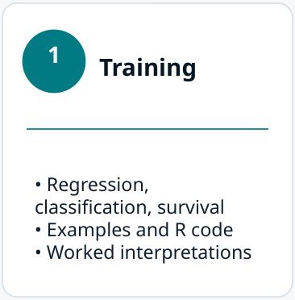
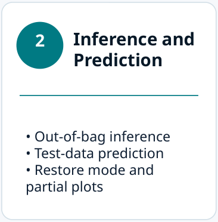
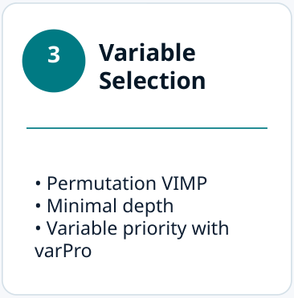
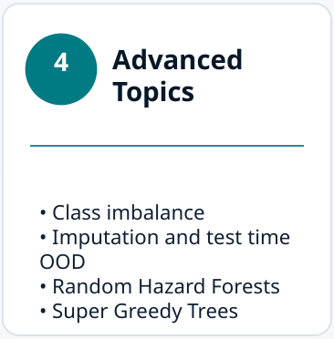
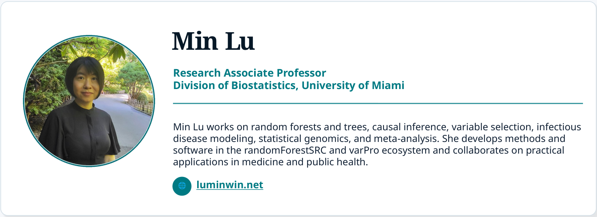
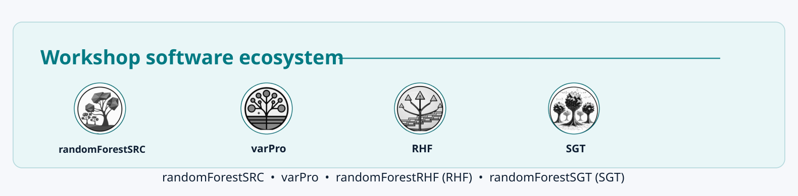

  

  

  

<table>
<tr align="center" valign="top">
<td width="25%"></td>
<td width="25%"></td>
<td width="25%"></td>
<td width="25%"></td>
</tr>
<tr align="center">
<td><a href="https://luminwin.github.io/ASAtravel/presentationPartI.html">Part I</a></td>
<td><a href="https://luminwin.github.io/ASAtravel/presentationPartII.html">Part II</a></td>
<td><a href="https://luminwin.github.io/ASAtravel/presentationPartIII.html">Part III</a></td>
<td><a href="https://luminwin.github.io/ASAtravel/presentationPartIV.html">Part IV</a></td>
</tr>
</table>

  

<table>
<tr valign="top">
<td width="50%"></td>
<td width="50%"></td>
</tr>
<tr valign="top">
<td width="50%"></td>
<td width="50%"></td>
</tr>
</table>

  

  

  

  

  

  

